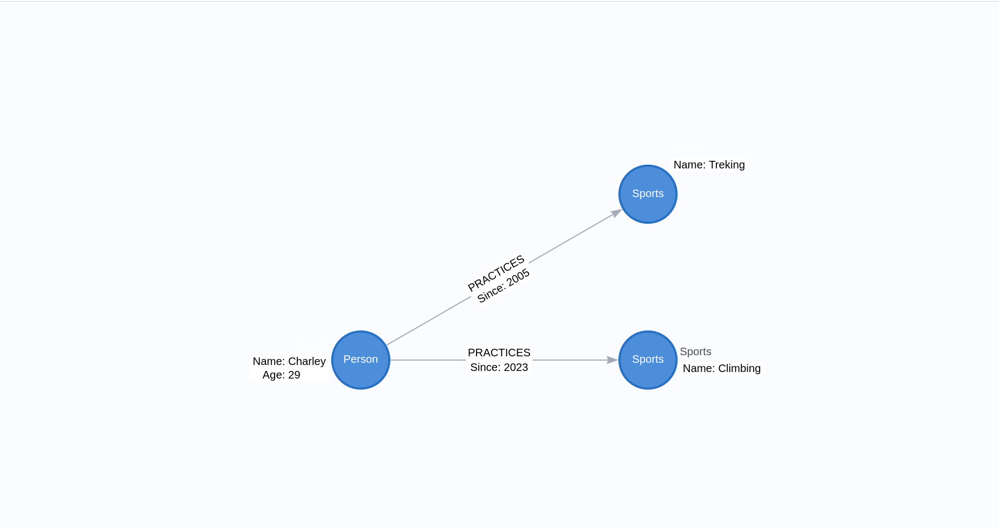
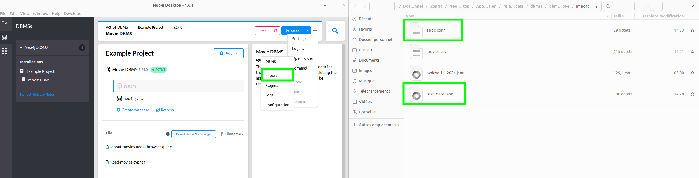
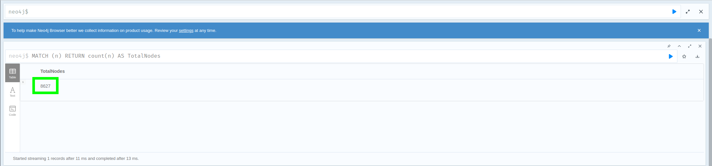
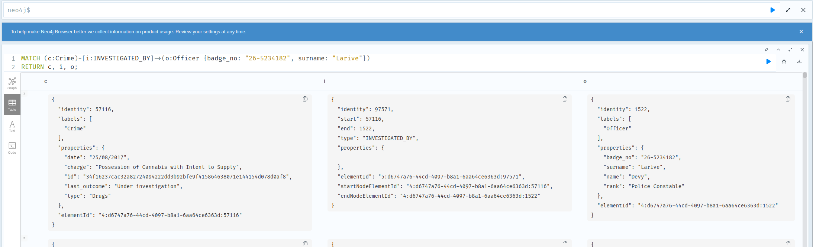

# Neo4j Graph Database


- [Introduction](#introduction)
- [Prerequisites](#prerequisites)
- [Installation](#installation)
- [Configuration](#configuration)
- [Usage of Python Script](#usage-of-python-script)
- [Commands](#commands)
- [APOC Procedures](#apoc-procedures)
- [Design of the Graph Database (arrows.app) (24/03/2025)](#design-of-the-graph-database-arrowsapp-24032025)
- [Activities (24/03/2025)](#activities-24032025)
- [Neo4j Sandbox : Graph data science (25/03/2025)](#neo4j-sandbox--graph-data-science-25032025)
- [Neo4j Sandbox : Crime investigation (25/03/2025)](#neo4j-sandbox--crime-investigation-25032025)
- [Neo4j : DO likes movies (25/03/2025)](#neo4j--do-likes-movies-25032025)


## Introduction

Neo4j is a graph database management system developed by Neo4j, Inc. Described by its developers as an ACID-compliant transactional database with native graph storage and processing.

## Prerequisites

- Python 3.x
- Neo4j
- `neo4j` library for Python

## Installation

1. Install the `neo4j` library:
```sh
pip install neo4j
```

2. Ensure that Neo4j is running and accessible.

## Configuration

Set the following environment variables with your Neo4j database connection information inside the `.env` file:

```sh
export NEO4J_URI="neo4j://localhost:7687"
export NEO4J_USERNAME="neo4j"
export NEO4J_PASSWORD="<password>"
```

**Note:** You can reset your password through the Neo4j Desktop application.


## Usage of Python Script

1. Run the Python script to connect to the Neo4j database and execute Cypher queries:

```sh
python3 main.py
```

The script will display the list of movies present in the Neo4j database.

**Output:**


## Commands

| Command                                      | Role                                                                                           |
|----------------------------------------------|------------------------------------------------------------------------------------------------|
| `MATCH (n) RETURN n`                         | Retrieve all nodes from the database.                                                           |
| `CREATE (n:Label {property: value})`         | Create a new node with a label and specified properties.                                        |
| `MERGE (n:Label {property: value})`           | Create a node if it doesn't exist, otherwise return the existing node matching the properties.  |
| `MATCH (n) DELETE n`                         | Delete a node from the graph.                                                                   |
| `MATCH (n) DETACH DELETE n`                  | Delete a node and all its associated relationships.                                             |
| `RETURN DISTINCT`                            | Return only distinct (non-duplicate) results.                                                   |
| `SET n.property = value`                     | Modify a property on a node or relationship.                                                   |
| `REMOVE n.property`                          | Remove a property from a node or relationship.                                                  |
| `WITH`                                       | Pass intermediate results within a complex query pipeline.                                      |
| `UNWIND`                                     | Unwind a list into multiple rows for further processing.                                       |
| `WHERE`                                      | Apply a condition to filter query results.                                                     |
| `RETURN`                                     | Specify which results to return after query execution.                                         |
| `ORDER BY`                                   | Sort results based on specified properties.                                                    |
| `LIMIT`                                      | Limit the number of results returned by the query.                                              |
| `SKIP`                                       | Skip a specified number of results (used with `LIMIT` for pagination).                         |
| `CALL`                                       | Execute a procedure or function (e.g., `CALL apoc.load.csv()` to load a file).                 |
| `apoc.load.csv("file:///path/to/file.csv")`  | Load a CSV file into Neo4j from the local filesystem.                                           |
| `apoc.export.graphml()`                       | Export the graph as a GraphML file.                                                            |
| `apoc.load.json()`                           | Load data from a JSON file into Neo4j.                                                          |                                                       |
| `apoc.meta.dataType()`                       | Get the data type of an element (e.g., string, integer, list).                                  |
| `EXPLAIN`                                    | Explain a query without executing it, providing details about its execution plan.              |
| `PROFILE`                                    | Execute a query and display a detailed execution profile (useful for optimizing queries).      |
| `RETURN count(*)`                            | Count the number of results returned.                                                          |


## APOC Procedures

**APOC (Awesome Procedures On Cypher)** is a library of useful procedures and functions for **Neo4j**. It extends Cypher with extra capabilities like data import/export, string and list manipulation, graph algorithms, and performance optimizations. APOC helps simplify complex queries and automate tasks in Neo4j.

## Design of the Graph Database (arrows.app) (24/03/2025)

It's possible to design the graph database using the arrows.app tool. The following diagram represents the schema of the graph database:



Then you can export the schema as a Cypher script and execute it in the Neo4j database.


## Activities (24/03/2025)

1. Install APOC plugin in Neo4j Desktop.


2. Import `apoc.conf` and `test_data.json` file in the Neo4j configuration directory.



3. Load `test_data.json` file into Neo4j using the following Cypher query:

```cypher
CALL apoc.load.json("file:///test_data.json") YIELD value
```

**Output:**


4. Import `movies.csv` file in the Neo4j configuration directory.

5. Restart the Neo4j database to apply the changes.

6. Load `movies.csv` file into Neo4j and return the number of records:

```cypher
LOAD CSV WITH HEADERS FROM 'file:///movies.csv' AS csvLine
RETURN count(csvLine)
```

**Output:**


7. Load `movies.csv` file into Neo4j and create nodes for movies and countries:

```cypher
LOAD CSV WITH HEADERS FROM 'file:///movies.csv' AS csvLine
MERGE (country:Country { name: csvLine.country })
CREATE (movie:Movie { id: toInteger(csvLine.id), title: csvLine.title, year:toInteger(csvLine.year)})
CREATE (movie)-[:MADE_IN]->(country)
```

**Output:**


8. Check the nodes and relationships created in the Neo4j database:

```cypher
MATCH (m:Movie)-[:MADE_IN]->(c:Country)
RETURN m.title AS Movie, m.year AS Year, c.name AS Country
ORDER BY m.year DESC;
```

**Output:**


9. Import `questions.json` file in the Neo4j configuration directory.

**Output:**


10. Load `questions.json` file into Neo4j and create nodes for questions and answers:

```cypher
CALL apoc.load.json('file:///questions.json') YIELD value
UNWIND value.items as item

MERGE (question:Question {
    id: item.question_id,
    title: item.title,
    score: item.score,
    view_count: item.view_count,
    creation_date: datetime({epochSeconds: item.creation_date})
})

WITH item, question
UNWIND item.tags as tagName
MERGE (tag:Tag {name: tagName})
CREATE (question)-[:TAGGED]->(tag)

WITH item, question
MERGE (author:User {
    id: item.owner.user_id,
    display_name: item.owner.display_name,
    reputation: item.owner.reputation
})
CREATE (author)-[:ASKED]->(question)

WITH item, question
UNWIND item.answers as answerData
MERGE (answer:Answer {
    id: answerData.answer_id,
    score: answerData.score,
    is_accepted: answerData.is_accepted,
    creation_date: datetime({epochSeconds: answerData.creation_date})
})
CREATE (answer)-[:ANSWERS]->(question)

MERGE (answerer:User {
    id: answerData.owner.user_id,
    display_name: answerData.owner.display_name,
    reputation: answerData.owner.reputation
})

CREATE (answerer)-[:PROVIDED]->(answer);
```

**Output:**


11. Display the schema visualization : 

```cypher
call db.schema.visualization
```

**Output:**


## Neo4j Sandbox : Graph data science (25/03/2025)


1. Create a new "Graph data science" project in Neo4j Sandbox.

2. Display the schema visualization of the graph.

```cypher
call db.schema.visualization
```


3. Get total number of nodes (8627).

```cypher
MATCH (n) RETURN count(n) AS TotalNodes
```



3. Get total number of relationships (73954).
   
```cypher
MATCH ()-[r]->() RETURN count(r) AS TotalRelationships
```


4. Get the total number of Airport nodes (3503).

```cypher
MATCH (a:Airport) RETURN count(a) AS TotalAirports
```


5. Get the total number of relationships of type `HAS_ROUTE` (67663).

```cypher
MATCH ()-[r:HAS_ROUTE]->() RETURN count(r) AS TotalRelationships
```


6. Use a pageRank algorithm to find the most important airports in the graph then return the airport order by pageRank.

```cypher
// Write pageRank property 
CALL gds.pageRank.write('routes',
    {
        writeProperty: 'pageRank'
    }
)
YIELD nodePropertiesWritten, ranIterations
```

```cypher
// Show me the airports ordered by pageRank
MATCH (a:Airport)
RETURN a.iata AS iata, a.descr AS description, a.pageRank AS pageRank
ORDER BY a.pageRank DESC, a.iata ASC
```


1. Find the shortest path between 'Melbourne Airport' and 'Denver' using the Dijkstra algorithm.

```cypher
MATCH (source:Airport {iata: "MEL"}), (target:Airport {iata: "DEN"})
CALL gds.shortestPath.dijkstra.stream('routes', {
    sourceNode: id(source),
    targetNode: id(target)
})
YIELD index, sourceNode, targetNode, totalCost, nodeIds, costs, path
RETURN
    totalCost,
    [nodeId IN nodeIds | gds.util.asNode(nodeId).descr] AS stops;
```


## Neo4j Sandbox : Crime investigation (25/03/2025)


1. Find the details of all the crimes under investigation by Officer 'Larive' (Badge Number 26-5234182)

```cypher
MATCH (c:Crime)-[i:INVESTIGATED_BY]->(o:Officer {badge_no: "26-5234182", surname: "Larive"})
RETURN c, i, o;
```




1. Find the details of all the crimes under investigation by Officer 'Larive' (Badge Number 26-5234182) related to the 'Drugs' category.

```cypher
MATCH (c:Crime {last_outcome: "Under investigation", type: "Drugs"})-[i:INVESTIGATED_BY]->(o:Officer {badge_no: "26-5234182", surname: "Larive"})
RETURN *;
```


## Neo4j : DO likes movies (25/03/2025)

1. Create all students and movies nodes.

```cypher
MATCH (n) DETACH DELETE n;

CREATE
    (mateo:User {name: "Matéo" }),
    (adrien:User {name: "Adrien" }),
    (noe:User {name: "Noé" }),
    (muriel:User {name: "Muriel" }),
    (thomas:User {name: "Thomas" }),
    (vincent:User {name: "Vincent" }),
    (martin:User {name: "Martin" }),
    (dziyana:User {name: "Dziyana" }),
    (charley:User {name: "Charley" }),
    (remi:User {name: "Rémi" }),
    (fabien:User {name: "Fabien" }),
    (alexandre:User {name: "Alexandre" }),
    (sylvain:User {name: "Sylvain" }),
    (mathias:User {name: "Mathias" }),
    (m0:Movie {title: "The Matrix", genre: "Action"}),
    (m1:Movie {title: "Inception", genre: "Sci-Fi" }),
    (m2:Movie {title: "The Godfather", genre: "Drama" }),
    (m3:Movie {title: "Forest Gump", genre: "Drama"}),
    (m4:Movie {title: "Interstellar", genre: "Sci-Fi" }),
    (m5:Movie {title: "Mission Impossible", genre: "Action" }),
    (m6:Movie {title: "La La Land", genre: "Musical" }),
    (m7:Movie {title: "The Dark Knight", genre: "Action"}),
    (m8:Movie {title: "Pulp Fiction", genre: "Crime"}),
    (m9:Movie {title: "The Shawshank Redemption", genre: "Drama"}),
    (m10:Movie {title: "Star Wars: A New Hope", genre: "Sci-Fi"}),
    (m11:Movie {title: "The Lion King", genre: "Animation"}),
    (m12:Movie {title: "The Silence of the Lambs", genre: "Thriller"}),
    (m13:Movie {title: "Amélie Poulain", genre: "Romance"}),
    (m14:Movie {title: "The Grand Budapest Hotel", genre: "Comedy"}),
    (mateo)-[:LIKES]->(m0),
    (alexandre)-[:LIKES]->(m2),
    (remi)-[:LIKES]->(m4),
    (thomas)-[:LIKES]->(m4),
    (noe)-[:LIKES]->(m5),
    (muriel)-[:LIKES]->(m1),
    (mathias)-[:LIKES]->(m1),
    (sylvain)-[:LIKES]->(m0),
    (fabien)-[:LIKES]->(m5),
    (vincent)-[:LIKES]->(m4),
    (martin)-[:LIKES]->(m0),
    (adrien)-[:LIKES]->(m4),
    (charley)-[:LIKES]->(m4),
    (dziyana)-[:LIKES]->(m0),
    (mateo)-[:LIKES]->(m7),
    (mateo)-[:LIKES]->(m10),
    (adrien)-[:LIKES]->(m9),
    (adrien)-[:LIKES]->(m13),
    (noe)-[:LIKES]->(m8),
    (noe)-[:LIKES]->(m12),
    (muriel)-[:LIKES]->(m11),
    (muriel)-[:LIKES]->(m14),
    (thomas)-[:LIKES]->(m10),
    (thomas)-[:LIKES]->(m7),
    (vincent)-[:LIKES]->(m9),
    (vincent)-[:LIKES]->(m2),
    (martin)-[:LIKES]->(m8),
    (martin)-[:LIKES]->(m12),
    (dziyana)-[:LIKES]->(m13),
    (dziyana)-[:LIKES]->(m11),
    (charley)-[:LIKES]->(m14),
    (charley)-[:LIKES]->(m3),
    (remi)-[:LIKES]->(m7),
    (remi)-[:LIKES]->(m9),
    (fabien)-[:LIKES]->(m8),
    (fabien)-[:LIKES]->(m12),
    (alexandre)-[:LIKES]->(m10),
    (alexandre)-[:LIKES]->(m11),
    (sylvain)-[:LIKES]->(m13),
    (sylvain)-[:LIKES]->(m14),
    (mathias)-[:LIKES]->(m3),
    (mathias)-[:LIKES]->(m6),
    (mateo)-[:FRIENDS_WITH]->(adrien),
    (mateo)-[:FRIENDS_WITH]->(noe),
    (mateo)-[:FRIENDS_WITH]->(sylvain),
    (adrien)-[:FRIENDS_WITH]->(vincent),
    (adrien)-[:FRIENDS_WITH]->(charley),
    (noe)-[:FRIENDS_WITH]->(fabien),
    (noe)-[:FRIENDS_WITH]->(thomas),
    (muriel)-[:FRIENDS_WITH]->(mathias),
    (muriel)-[:FRIENDS_WITH]->(dziyana),
    (thomas)-[:FRIENDS_WITH]->(remi),
    (vincent)-[:FRIENDS_WITH]->(martin),
    (martin)-[:FRIENDS_WITH]->(alexandre),
    (charley)-[:FRIENDS_WITH]->(remi),
    (fabien)-[:FRIENDS_WITH]->(sylvain),
    (alexandre)-[:FRIENDS_WITH]->(mathias);
```


2. Recommend movie to "Muriel" based on similar users liked

```cypher
MATCH (muriel:User {name: "Muriel"})-[:LIKES]->(movie:Movie)<-[:LIKES]-(similarUser:User)-[:LIKES]->(recMovie:Movie)
WHERE NOT (muriel)-[:LIKES]->(recMovie)
RETURN DISTINCT recMovie.title AS recommendedMovie
```


3. Recommend movie to "Dzyana" based on similar users liked

```cypher
MATCH (muriel:User {name: "Dziyana"})-[:LIKES]->(movie:Movie)<-[:LIKES]-(similarUser:User)-[:LIKES]->(recMovie:Movie)
WHERE NOT (muriel)-[:LIKES]->(recMovie)
RETURN DISTINCT recMovie.title AS recommendedMovie
```


4. Recommend movie to "Vincent" based on "SCIFI" genre

```cypher
MATCH (vincent:User {name: "Vincent"})-[:LIKES]->(movie:Movie)
WHERE movie.genre = "Sci-Fi"
MATCH (recMovie:Movie)
WHERE recMovie.genre = "Sci-Fi" AND NOT (vincent)-[:LIKES]->(recMovie)
RETURN DISTINCT recMovie.title AS recommendedMovie
```


