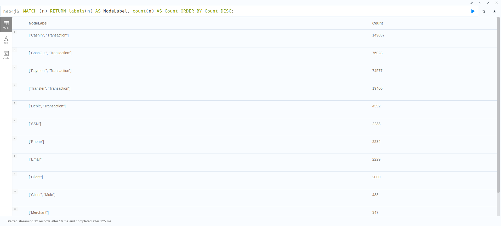

# Fraud Detection


## Schema Visualization

```cypher
CALL db.schema.visualization();
```


---

### Nodes Count (332973)

```cypher
MATCH (n) RETURN count(n) AS TotalNodes;
```


###  Relationships Count (980098)

```cypher
MATCH ()-[r]->() RETURN count(r) AS TotalRelationships;
```


---

## Node Labels and their Count

```cypher
MATCH (n) RETURN labels(n) AS NodeLabel, count(n) AS Count ORDER BY Count DESC;
```



---

## Relationship Types and their Count 

```cypher
MATCH ()-[r]->() RETURN type(r) AS RelationshipType, count(r) AS Count ORDER BY Count DESC;
```


## Running all commands using Python (whithout Spark)

```python
spark-submit main.py
```


## Running all commands using Python (with Spark)


> [!NOTE] 
>  The [neo4j-connector-apache-spark_2.12-5.3.5_for_spark_3.jar](https://github.com/neo4j/neo4j-spark-connector/releases/download/5.3.5/neo4j-connector-apache-spark_2.12-5.3.5_for_spark_3.jar) is required to run the spark job.


```python
spark-submit --jars neo4j-connector-apache-spark_2.12-5.3.5_for_spark_3.jar main-spark.py
```


---

## Running using Kubernetes (k3d)

### Setting up the Kubernetes Cluster

1.  Create a Kubernetes Cluster with k3d

```bash
k3d cluster create my-spark-cluster --servers 1 --agents 2
```

- Creates a Kubernetes cluster named `my-spark-cluster` with `1 server` node and `2 agent` nodes.

2. Grant the necessary permissions to the Kubernetes Cluster

```bash
kubectl create clusterrolebinding spark-role --clusterrole=edit --serviceaccount=default:default --namespace=default
```

3. Install the Spark Operator with Helm

```bash
helm repo add spark-operator https://kubeflow.github.io/spark-operator
helm repo update
helm install spark-operator spark-operator/spark-operator \
    --namespace spark-operator \
    --create-namespace
```

### Deploying the Spark Application

1. Build the Docker Image
   
```bash
docker build -t spark:partiel .
```

2. Import the Docker Image to Kubernetes

```bash
k3d image import -c my-spark-cluster spark:partiel
```

3. Deploy the application

```bash
kubectl apply -f ./kube/spark.yaml
```


**Kubernetes Output**

1. Relationship 


2. Node Labels


3. Node Count


4. Relationship Types


## Exercices 

1.  Find out what types of transactions do these Clients perform with first party fraudsters?

```cypher
MATCH (:Client:FirstPartyFraudster)-[]-(txn:Transaction)-[]-(c:Client)
WHERE NOT c:FirstPartyFraudster
UNWIND labels(txn) AS transactionType
RETURN transactionType, count(*) AS freq;
```


1. How many clusters of FraudRings with greater than 9 client nodes. (THIS IS A GRAPH VISUALIZATION OUTPUT TO BE ADDED IN YOUR REPORT) -- THIS IS RELATED TO NEO4J CYPHER TASK

```cypher
MATCH (c:Client)
WITH c.firstPartyFraudGroup AS fpGroupID, collect(c.id) AS fGroup
WITH *, size(fGroup) AS groupSize 
WHERE groupSize > 9
WITH collect(fpGroupID) AS fraudRings
MATCH p=(c:Client)-[:HAS_SSN|HAS_EMAIL|HAS_PHONE]->()
WHERE c.firstPartyFraudGroup IN fraudRings
RETURN p
pour la 6
```


3. How many clusters of SecondPartyFraudsters with more than 10 client nodes. (THIS IS A GRAPH VISUALIZATION OUTPUT TO BE ADDED IN YOUR REPORT) -- THIS IS RELATED TO NEO4J CYPHER TASK

```cypher
MATCH (c:Client)
WITH c.firstPartyFraudGroup AS fpGroupID, collect(c.id) AS fGroup
WITH *, size(fGroup) AS groupSize 
WHERE groupSize > 10
WITH collect(fpGroupID) AS fraudRings
MATCH p=(c:Client)-[:HAS_SSN|HAS_EMAIL|HAS_PHONE]->()
WHERE c.firstPartyFraudGroup IN fraudRings
RETURN p;
```


