# Spark and Python using VSCODE  (26/03/2025)
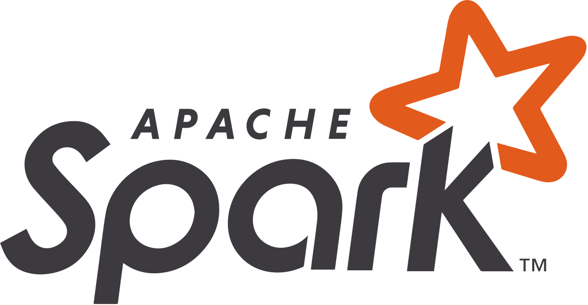

- [Running Self-Contained Applications (counting words)](#running-self-contained-applications-counting-words)
- [Running Self-Contained Applications (load and store csv file)](#running-self-contained-applications-load-and-store-csv-file)
- [Connecting Neo4j with Spark](#connecting-neo4j-with-spark)


1. Install Spark on your local machine

```bash
wget wget https://dlcdn.apache.org/spark/spark-3.5.5/spark-3.5.5-bin-hadoop3.tgz
tar -xvzf spark-3.5.5-bin-hadoop3.tgz
mv spark-3.5.5-bin-hadoop3 ~/spark
```

2. Export the path to your .bashrc or .zshrc file

```bash
export SPARK_HOME=~/spark
export PATH=$SPARK_HOME/bin:$PATH
```

3. Verify the installation

```bash
spark-shell
spark-submit
```

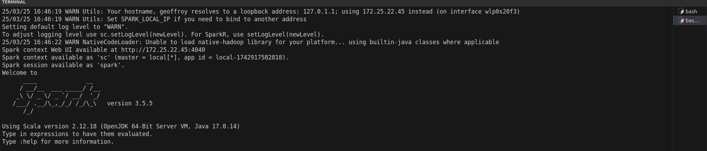


4. Run self-contained applications

```bash
spark-submit main.py
```

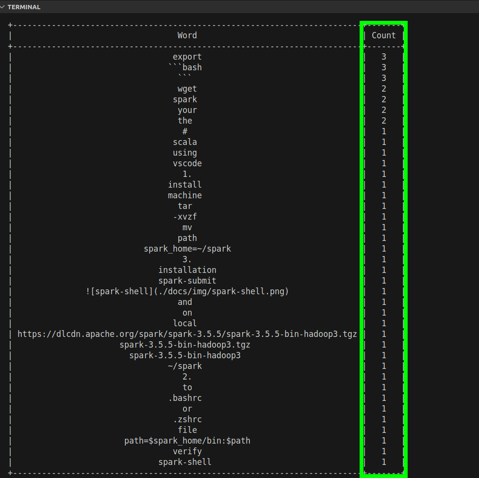


# Kubernetes:  Spark Deployment Commands  (27/03/2025)

## Running Self-Contained Applications (counting words)

1. Build the Docker Image

```bash
docker build -t spark-py:simple-app .
```

> [!NOTE] 
> This Dockerfile contains the necessary instructions to build a Docker image that includes `counting words application` and `load data application` using MinIO.


- Builds a Docker image named spark-py:simple-app using the current directory's Dockerfile.

2.  Create a Kubernetes Cluster with k3d


```bash
k3d cluster create my-spark-cluster --servers 1 --agents 2
```

- Creates a Kubernetes cluster named `my-spark-cluster` with `1 server` node and `2 agent` nodes.

3. Import the Docker Image into the Kubernetes Cluster

```bash
k3d image import -c my-spark-cluster spark-py:simple-app
```


4. Install the Spark Operator with Helm

```bash
helm repo add spark-operator https://kubeflow.github.io/spark-operator
helm repo update
helm install spark-operator spark-operator/spark-operator \
    --namespace spark-operator \
    --create-namespace
```

- Adds the Spark Operator Helm repository.
- Updates the Helm repository index.
- Installs the Spark Operator in the spark-operator namespace, creating the namespace if it doesn't exist.

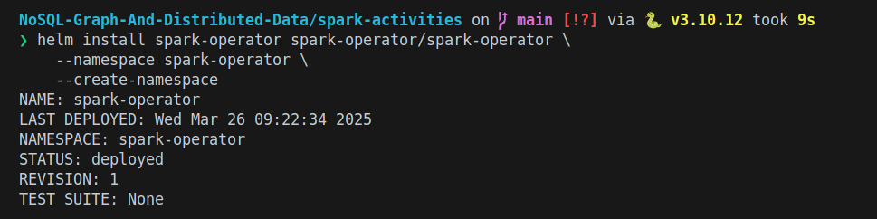


5. Create a Cluster Role Binding

```bash
kubectl create clusterrolebinding spark-role --clusterrole=edit --serviceaccount=default:default --namespace=default
```
- Grants the edit cluster role to the default service account in the default namespace.

6. Deploy the Counting Words Application

```bash
kubectl apply -f kube/sparkApplication.yaml
```

- Deploys the Spark application using the SparkApplication custom resource definition.

**Output from K9s**

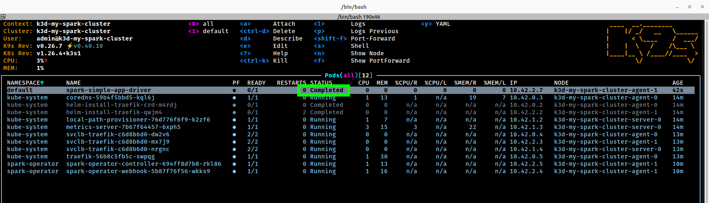

**Output from App Logs**

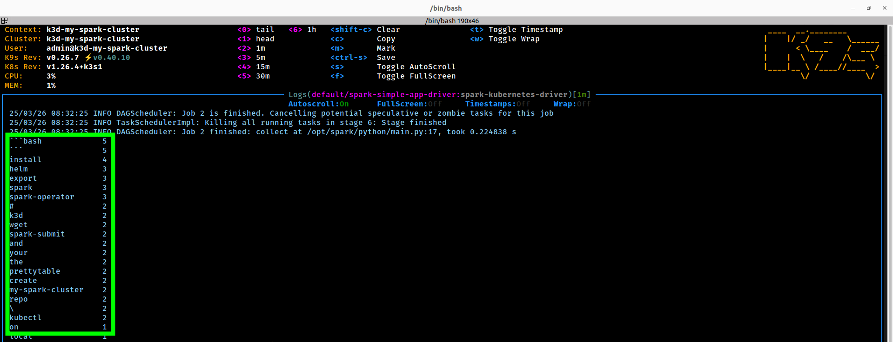


## Running Self-Contained Applications (load and store csv file)


1. Add MinIO operator to the Kubernetes Cluster

```bash
helm repo add minio-operator https://operator.min.io
helm repo update
helm install \
  --namespace minio-operator \
  --create-namespace \
  operator minio-operator/operator
```

2. Create a MinIO instance

```bash
kubectl apply -f kube/minio/minio-base.yaml
```

- Then you can port-forward the MinIO service to access the MinIO dashboard.

```bash
kubectl port-forward -n minio minio-<id> 9001:9001
```

3. Create Bucket and Upload File

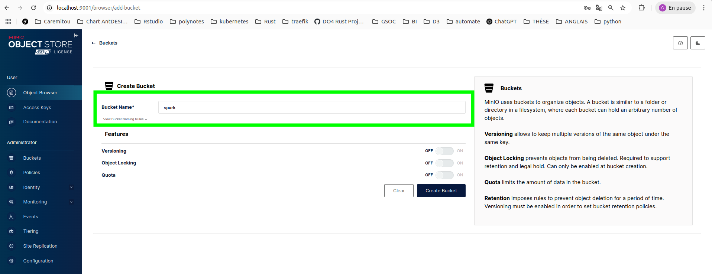

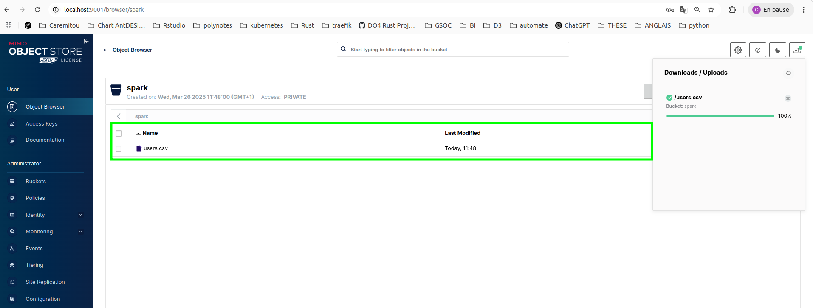

4. Deploy the Spark Application

```bash
kubectl apply -f kube/sparkApplication-minio.yaml
```

- Deploys the Spark application using the SparkApplication custom resource definition.

**Output from K9s**

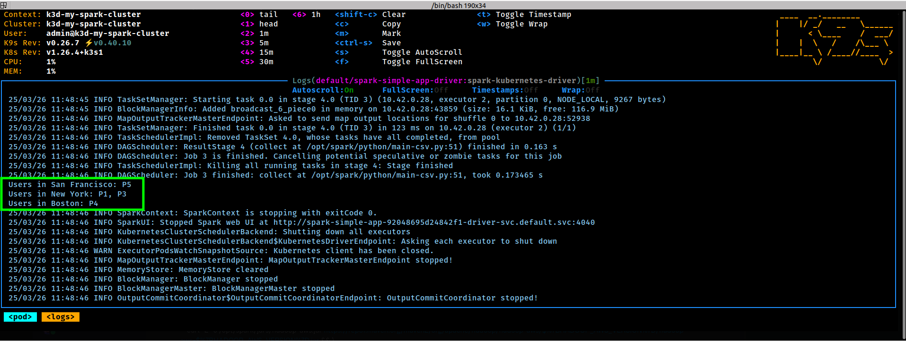


5. Print the `Stackoverflow Analysis` from the Spark Application (Using Spark SQL)

```bash
kubectl apply -f kube/sparkApplication-minio.yaml
```

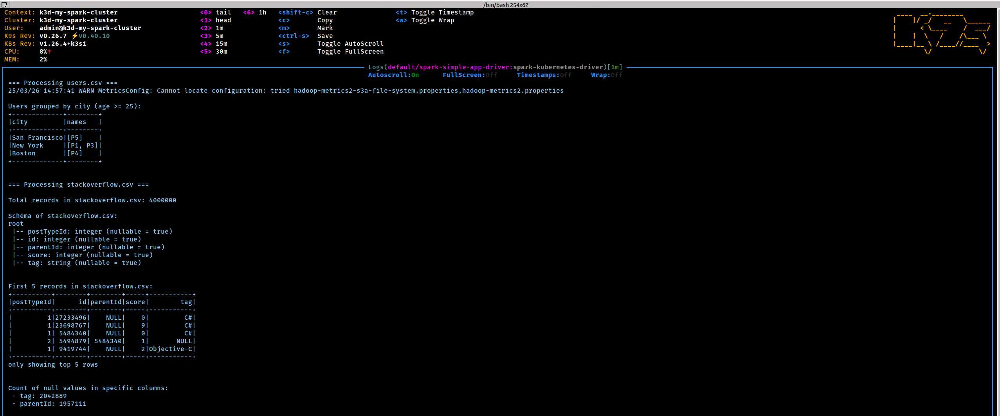
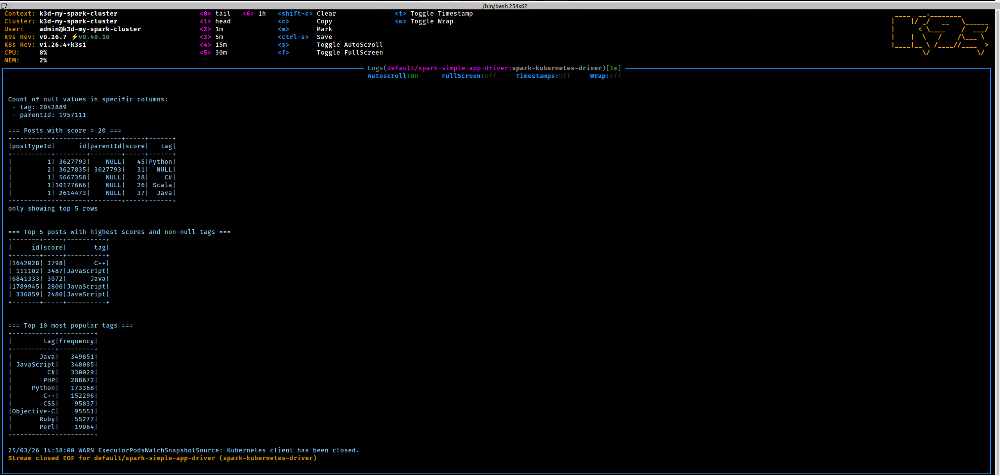


## Connecting Neo4j with Spark

1. Run Python script 

Before running the script make sure you have [the following jars](https://github.com/neo4j/neo4j-spark-connector/releases) in the same directory as the script:

```bash
spark-submit --jars neo4j-connector-apache-spark_2.12-5.3.5_for_spark_3.jar main-neo4j.py
```

**Output**:

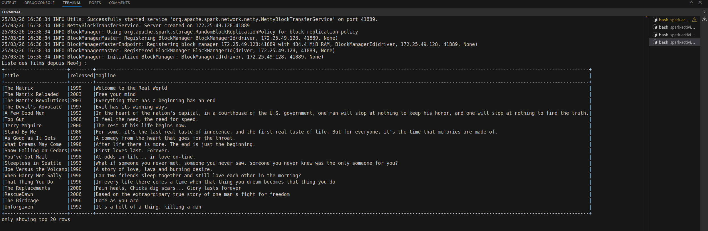

2. Running within a Kubernetes Cluster

```bash
kubectl apply -f kube/sparkApplication-neo4j.yaml
```

**Output from K9s**

