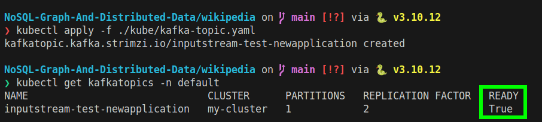

# Wikipedia Data (27/03/2025)

Before running the activities, make sure you have build and import the docker image to the k3d cluster.

```bash
docker build -t spark-streaming:simple-app 
k3d image import -c my-spark-cluster spark-streaming:simple-app
```

## Questions (Activities 6)

1. Load the file
2. Identify the fields (Title, text, category, reference, redirect)
3. Convert the the raw data in dataframe
4. Count top 50 categories


## Answers

1. Run the following command

```python
spark-submit activities-1.py
```


## Questions (Activities 7)

- Implement Apacha Spark File Streaming
- Implement Apache Spark With Kafka Streaming

## Answers

1. Run spark operator

```bash
kubectl apply -f ./kube/sparkApplication-streaming.yaml
```

4. Install Kafka Operator

```bash
helm repo add strimzi https://strimzi.io/charts/
helm upgrade --install my-strimzi-kafka-operator strimzi/strimzi-kafka-operator --version 0.45.0 --set fullReconciliationIntervalMs=3000 --set watchAnyNamespace=true
```

5. Install Kafka Cluster using Zookeeper

```bash
kubectl apply -f ./kube/kafka-cluster.yaml
```

6. Check if the kafka cluster is created

```bash
kubectl get pods -l app.kubernetes.io/name=kafka
```


7. Create a topic

```bash
kubectl apply -f ./kube/kafka-topic.yaml
```

8. Check if the topic is created

```bash
kubectl get kafkatopics -n default
```




9. Then from terminal, run the following command to produce and consume messages 

**Split the terminal and run the following command to produce messages**

```bash
kubectl --namespace default exec -it my-cluster-kafka-0 -c kafka -- bin/kafka-console-producer.sh --bootstrap-server localhost:9092 --topic  inputStream.test.newApplication
```

Once the producer is running, you can start typing messages.

**Split the terminal and run the following command to consume messages**

```bash
 kubectl --namespace default exec -it my-cluster-kafka-1 -c kafka -- bin/kafka-console-consumer.sh --bootstrap-server localhost:9092 --topic  inputStream.test.newApplication
```

**Output** 


10. Conusme the messages in the spark streaming application withing the k3d cluster

```bash
kubectl apply -f ./kube/sparkApplication-kafka.yaml
```


